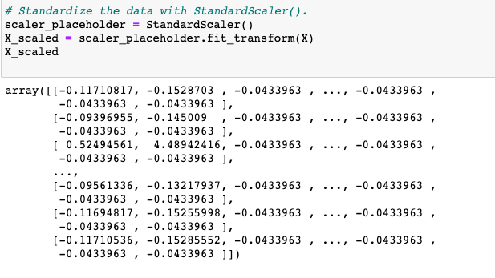
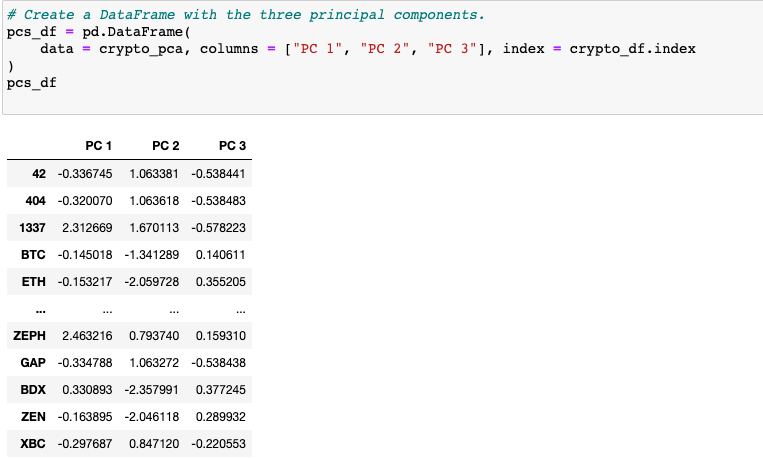
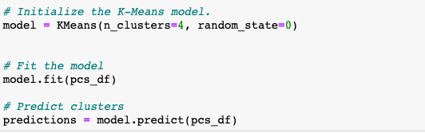
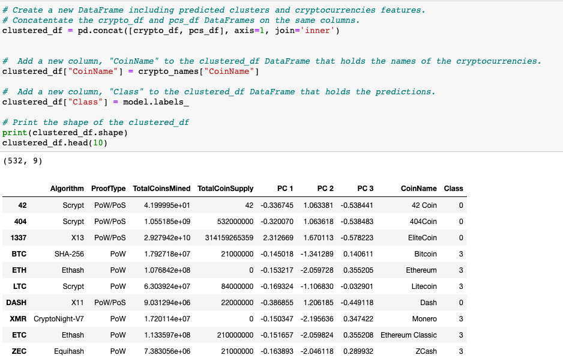
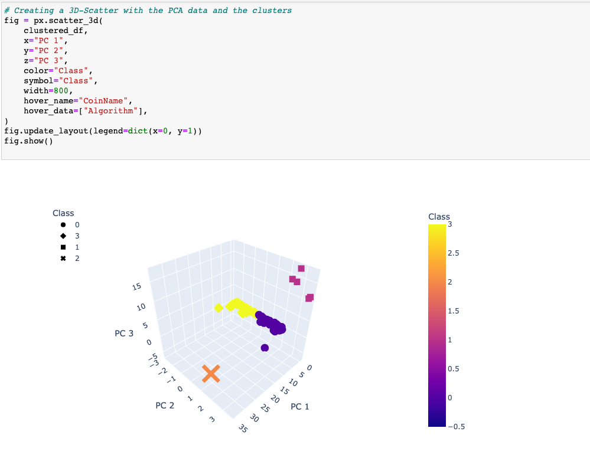
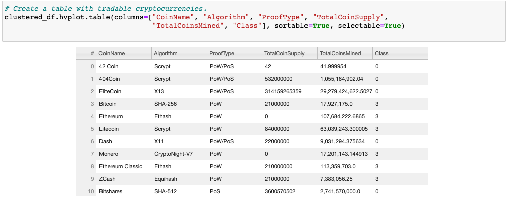
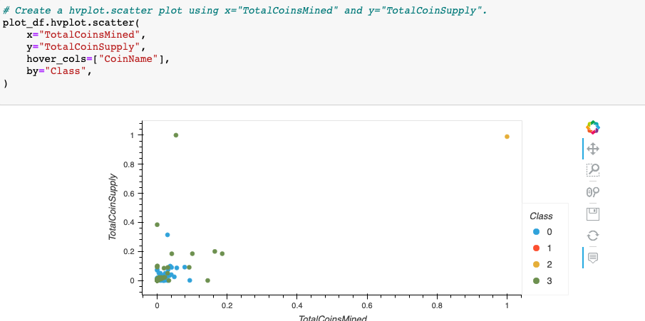

# Cryptocurrencies_Analysis
Analyzing cryptocurrencies with unsupervised machine learning.
 

Tyrone Fraley 
UC Berkley Extension 
Jan 11, 2023 

 

  

 

## Overview

 
For this analysis I built an unsupervised machine learning model for a firm called Accountability Accounting. To better assist them I built the unsupervised machine learning model to report on what crytpocurrencies are trading on the market and group them to create a classification system for future investments.
The process for building the machine learning model will involve PCA (principal component analysis) which will allow me to increase the speed of the algorithms. First, I preprocessed the data for PCA with the help of pandas. Which was done by reading the csv file, dropping any unnecessary columns, keep the cryptocurrencies that were being traded, remove any null values, and filter the data to ensure that the new data frame included only rows where coins were mined. Next, I created a new data frame that only included cryptocurrency names. Finally, I used the get_dummies() method to develop variabes for the Agorithm and Prooftype columns which were based on text values. This data was then deployed to a new data frame called "X". From here the StandardScaler (fit_transform()) was used to standardize the features that made up the X data frame.
 

  

 
The next process in the analysis was to reduce the data dimensions. Which was done with the help of PCA. First, I reduced the dimension to three principal components (pca = PCA(n_components=3)). From here the data was scaled through the following code: crypto_pca = pca.fit_transform(X_scaled) and then deployed as a data frame. 
 

  

 
The third part of the analysis involved clustering the cryptocurrencies by using K-Means. The first step in this process involved creating an elbow curve to find the best value for K. This was done by first assigning an empty list to inertia (inertia=[]). I then set the range for k as k= list(range(1, 11)). Next I initialized the K-Means model, fit the model, and predicted the clusters. 
 

  

 
The final process of the third sequence in this analysis involved creating a new data frame that would include any predicted clusters and cryptocurrency features. This was done by concatenating the crypto_df and the pcs_df, but on the same columns into a new data frame called "clustured_df." From here a new column was assigned as "CoinName." Another column was added to the clustured_df data frame. This column was named "Class" and was used to hold predictions.

 

  

 
The final deliverable for this project was to visualize the crypto currency results. First I created a 3D-Scatter plot with the PCA data and their clusters. Next, I created a table that would contain all of the tradable currencies. I then scaled the data so that i may be able to create a scatter plot that would have the tradable cryptocurrencies (clustered_scaled = MinMaxScaler().fit_transform(clustered_df[["TotalCoinSupply", "TotalCoinsMined"]]). Then a new data frame was created that would contain the scaled data with the clustered_df created in section three of the analysis. Finally, the data was plotted through hvplot.scatter by using x as the "TotalCoinsMined" and y as the "TotalCoinSupply."

 

  

 
 

  

 
 

  

 
